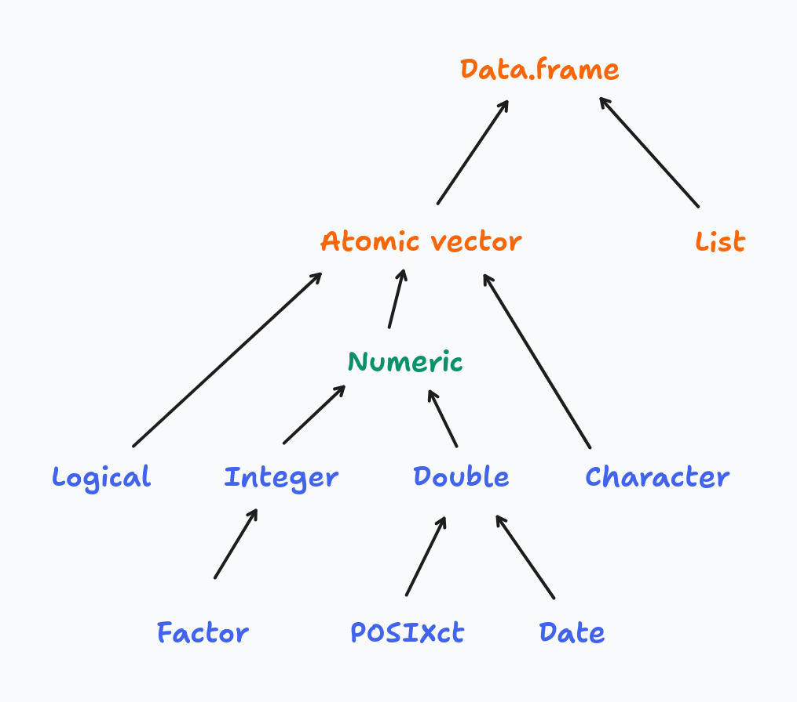
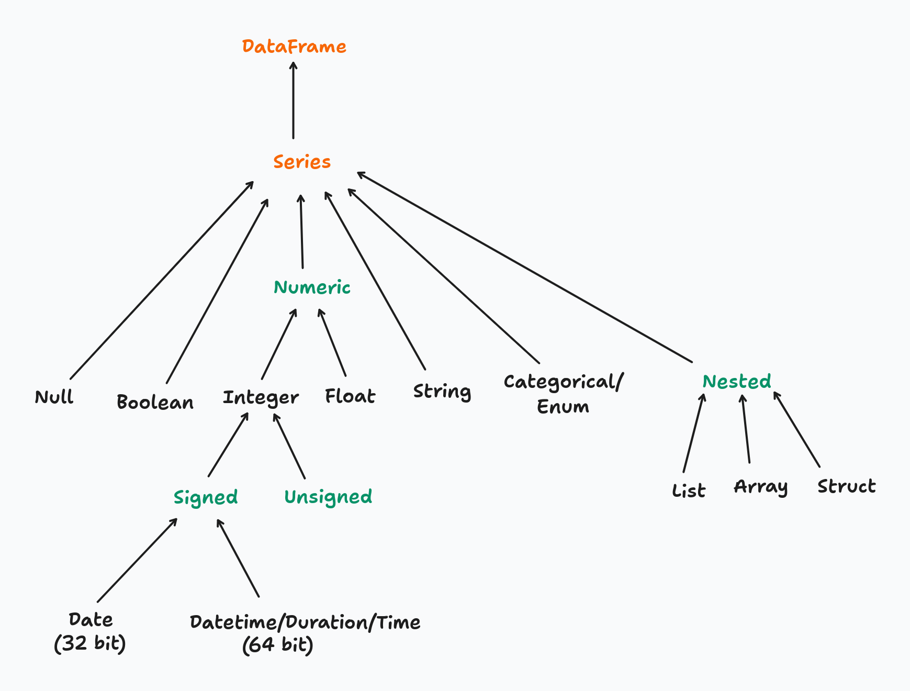

# Data manipulation

```{python}
#| include: false
import polars as pl
```

To showcase the robust syntax and efficiency of the polars package, we will leverage a moderately-sized dataset, comprising approximately 530,000 rows.

```{python}
full_flights = pl.read_csv('./data/On_Time_Reporting_Carrier_On_Time_Performance_(1987_present)_2022_1.csv')
full_flights.shape
```

```{python}
full_flights.estimated_size('mb')
```

## Data type conversion

The way R and Polars handle types reflects a fundamental design difference: R prioritises convenience through implicit coercion, while Polars prioritises correctness through explicit conversion.

### R: implicit type coercion

R's type system is built around four atomic vector types — logical, integer, double, and character — arranged in a coercion hierarchy:



When you combine values of mixed types, R silently promotes them up the hierarchy to find a common type:

```r
# R coerces everything to the "highest" type in the hierarchy
x <- c(TRUE, 1L, 2.5)
typeof(x)  # "double" — logical and integer were silently promoted

y <- c(TRUE, 1L, 2.5, "text")
typeof(y)  # "character" — everything coerced to string
```

This makes interactive exploration forgiving — R rarely stops you with a type error. The cost is that type mismatches surface as subtly wrong results rather than loud errors, which makes bugs hard to trace in larger codebases.

### Polars: explicit type conversion

Polars has a much richer type system — granular numeric types (`Int8` through `Int64`, `UInt8` through `UInt64`, `Float32`, `Float64`), dedicated temporal types, nested types, and more:



Polars **never coerces silently**. Every type change must be declared explicitly with `.cast()`. You can inspect the current type of a column before acting on it:

```{python}
full_flights['Year'].dtype
```

To convert the `Year` column from integer to string:

```{python}
full_flights = full_flights.with_columns(
    pl.col('Year').cast(pl.String)
)
full_flights['Year'].dtype
```

If `.cast()` cannot perform the conversion safely (e.g. casting `"abc"` to `Int64`), Polars raises an error immediately rather than producing a `null` or a wrong value — unless you explicitly opt in to lenient casting with `strict=False`.

The tradeoff is intentional: explicit casting is more verbose, but type contracts are visible in the code and mistakes fail loudly at the point of conversion. For production pipelines processing millions of rows, catching a type mismatch early is far cheaper than diagnosing a silently incorrect result downstream.

## Introduction to methods

In Python, a **method** is a function that belongs to an object and is invoked using dot notation: `object.method()`. The object provides both the data and the set of operations available on it.

The distinction from a standalone function comes down to ownership:

```python
# standalone functions — data is passed as an argument
len(full_flights)
pl.read_csv('./data/flights.csv')

# methods — the object is the implicit first argument
full_flights.shape
full_flights.head()
full_flights.filter(pl.col('OriginStateName') == 'Ohio')
```

A method always has implicit access to the object it belongs to. A `DataFrame` method like `.filter()` knows it is operating on a DataFrame; a `Series` method like `.mean()` knows it is operating on a Series. This means methods are **type-specific** — `.filter()` exists on a `DataFrame` but not on a `Series`.

### Comparison with R

R's tidyverse follows a **function-first** style: data is passed as the first argument to a verb, and the pipe operator chains those verbs into a pipeline:

```r
# R / dplyr: functions act on data passed as an argument
full_flights |>
    filter(OriginStateName == 'Ohio') |>
    select(FlightDate, Origin, Dest)
```

Python/Polars follows a **method chaining** style: the data object comes first, and methods are applied sequentially via the dot operator:

```{python}
#| eval: false
(
    full_flights
    .filter(pl.col('OriginStateName') == 'Ohio')
    .select(['FlightDate', 'Origin', 'Dest'])
)
```

The two patterns are structurally equivalent — both read as a left-to-right pipeline of transformations. The key difference is where the data lives: in R, data flows through functions as an argument; in Python, data is the object and methods are behaviors it carries with it.

One practical consequence of this is that in R, `filter()` works on any compatible object — data frames, tibbles, grouped tibbles. In Python, each type exposes its own set of methods, so you need to be aware of what type you are working with at each step of the chain.

## Single table operation


### Filtering rows

Filtering rows in Polars maps directly to dplyr's `filter()`. The function name is the same; the main syntax difference is that Polars requires column references to be wrapped in `pl.col()`.

* Retrieving all flights from Ohio (filtering based on one condition):

```r
# dplyr
flights_from_ohio <- full_flights |> filter(OriginStateName == "Ohio")
```

```{python}
flights_from_ohio = full_flights.filter(pl.col('OriginStateName') == 'Ohio')
flights_from_ohio.shape
```

* Filtering based on multiple conditions:

```r
# dplyr — comma-separated predicates are implicitly AND-ed
flights_from_ohio_to_virginia <- full_flights |>
    filter(OriginStateName == "Ohio", DestStateName == "Virginia")
```

```{python}
# note that each predicate must be enclosed within parentheses when using &
flights_from_ohio_to_virginia = full_flights.filter(
    (pl.col('OriginStateName') == 'Ohio') & (pl.col('DestStateName') == 'Virginia')
)

# comma-separated predicates are also AND-ed, avoiding the need for parentheses
# flights_from_ohio_to_virginia = full_flights.filter(
#     pl.col('OriginStateName') == 'Ohio',
#     pl.col('DestStateName') == 'Virginia'
# )

flights_from_ohio_to_virginia.shape
```

* Filtering with a negative condition:

```r
# dplyr
flights_from_ohio_except_virginia <- full_flights |>
    filter(OriginStateName == "Ohio", DestStateName != "Virginia")
```

```{python}
flights_from_ohio_except_virginia = full_flights.filter(
    pl.col('OriginStateName') == 'Ohio',
    ~(pl.col('DestStateName') == 'Virginia')
)
flights_from_ohio_except_virginia.shape
```

* Filtering with a set of values using `.is_in()`, the equivalent of R's `%in%` operator:

```r
# dplyr
major_hubs <- full_flights |>
    filter(OriginStateName %in% c("California", "Texas", "New York"))
```

```{python}
major_hubs = full_flights.filter(
    pl.col('OriginStateName').is_in(['California', 'Texas', 'New York'])
)
major_hubs.shape
```

* Why prefer `.filter()` over boolean indexing? The key reason is that `.filter()` integrates with Polars' lazy execution engine, which pushes the predicate down to the scan and avoids loading unnecessary rows into memory:

```{python}
import time

start = time.perf_counter()
lazy_result = (
    pl.scan_csv('./data/On_Time_Reporting_Carrier_On_Time_Performance_(1987_present)_2022_1.csv')
    .filter(pl.col('OriginStateName') == 'Ohio')
    .collect()
)
print(f"lazy:  {time.perf_counter() - start:.3f}s")

start = time.perf_counter()
eager_result = (
    pl.read_csv('./data/On_Time_Reporting_Carrier_On_Time_Performance_(1987_present)_2022_1.csv')
    .filter(pl.col('OriginStateName') == 'Ohio')
)
print(f"eager: {time.perf_counter() - start:.3f}s")
```

### Selecting columns

Polars offers three levels of column selection, progressing from explicit to declarative:

1. **By name** — a string list; simple but brittle if column names change
2. **By type** — `pl.col(dtype)` selects all columns of a given type
3. **Selectors** (`polars.selectors`) — a high-level API for flexible, composable selection based on types, name patterns, or properties

Selectors are the recommended approach for anything beyond a simple name list. They produce code that reads closer to intent, composes naturally with set operations, and adapts automatically when the schema changes.

#### Selecting by name

```r
# dplyr
full_flights |> select(FlightDate, Tail_Number)
```

```{python}
full_flights.select(['FlightDate', 'Tail_Number']).head(3)
```

#### Selecting by type

`pl.col(dtype)` selects all columns that match a given type. Useful for applying the same transformation to every column of a type:

```r
# dplyr
full_flights |> select(where(is.double))
full_flights |> select(where(is.integer))
```

```{python}
full_flights.select(pl.col(pl.Float64)).head(3)
```

```{python}
full_flights.select(pl.col(pl.Int64)).head(3)
```

#### Selecting with Selectors

`polars.selectors` provides a declarative selection API that closely mirrors dplyr's [selection helpers](https://dplyr.tidyverse.org/reference/select.html). Import it as `cs` by convention:

```{python}
import polars.selectors as cs
```

**Select by data type:**

```r
# dplyr
full_flights |> select(where(is.numeric))
full_flights |> select(where(is.character))
```

```{python}
full_flights.select(cs.numeric()).head(3)  # all Int*, UInt*, Float* columns
```

```{python}
full_flights.select(cs.string()).head(3)   # all String columns
```

**Select by name pattern:**

```r
# dplyr
full_flights |> select(starts_with("Flight"))
full_flights |> select(ends_with("Delay"))
```

```{python}
full_flights.select(cs.starts_with('Flight')).head(3)
```

```{python}
full_flights.select(cs.ends_with('Delay')).head(3)
```

**Combining selectors with set operations:**

This is where selectors go beyond what bare `pl.col()` can express. Selectors support set operations using Python operators, making complex multi-criteria selections readable in a single expression:

| operator | meaning                                        | dplyr equivalent          |
|----------|------------------------------------------------|---------------------------|
| `\|`     | union — columns matching either selector       | `c(starts_with(), ...)`   |
| `&`      | intersection — columns matching both selectors | `where(\(x) ... & ...)`   |
| `-`      | difference — left selector minus right         | not available             |
| `~`      | complement — all columns not matching          | `!selector`               |

```{python}
# union: columns starting with "Flight" OR ending with "Delay"
full_flights.select(cs.starts_with('Flight') | cs.ends_with('Delay')).head(3)
```

```{python}
# difference: numeric columns excluding Int64 (i.e. Float columns only)
full_flights.select(cs.numeric() - cs.integer()).head(3)
```

```{python}
# complement: everything except string columns
full_flights.select(~cs.string()).head(3)
```

A full comparison between dplyr and Polars selection features:

| dplyr action                            | dplyr function                    | polars selector    |
|-----------------------------------------|-----------------------------------|--------------------|
| matches all columns                     | `everything()`                    | `cs.all()`         |
| matches all numeric columns             | `where(is.numeric)`               | `cs.numeric()`     |
| matches all integer columns             | `where(is.integer)`               | `cs.integer()`     |
| matches all float columns               | `where(is.double)`                | `cs.float()`       |
| matches all string columns              | `where(is.character)`             | `cs.string()`      |
| matches all factor/categorical columns  | `where(is.factor)`                | `cs.categorical()` |
| matches all date columns                | `where(\(x) class(x) == "Date")`  | `cs.date()`        |
| matches all datetime columns            | not available                     | `cs.datetime()`    |
| matches all time columns                | not available                     | `cs.time()`        |
| matches all temporal columns            | not available                     | `cs.temporal()`    |
| select the last column                  | `last_col()`                      | `cs.last()`        |
| starts with a prefix                    | `starts_with()`                   | `cs.starts_with()` |
| ends with a suffix                      | `ends_with()`                     | `cs.ends_with()`   |
| contains a literal string               | `contains()`                      | `cs.contains()`    |
| matches a regular expression            | `matches()`                       | `cs.matches()`     |
| complement of a selection               | `!selector`                       | `~selector`        |
| difference between selections           | not available                     | `cs_a - cs_b`      |
| range of consecutive columns            | `col1:col10`                      | not available      |
| any of a list, ignoring missing names   | `any_of()`                        | not available      |

### Modify/Add column


### Rename column


### Remove column


### Aggregation by group


### Sort a DataFrame

## Two tables operation


### Join DataFrames


### Concatenate DataFrames


## Pivot a DataFrame


## Dealing with missing values


## Strings methods

## Handling datetime

## Other useful methods